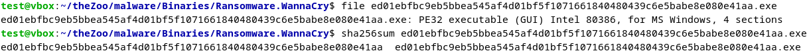
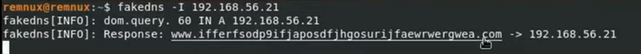
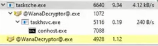
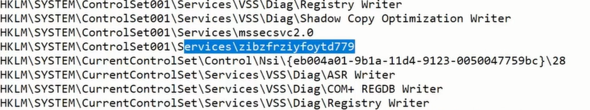
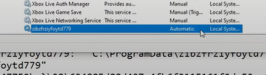
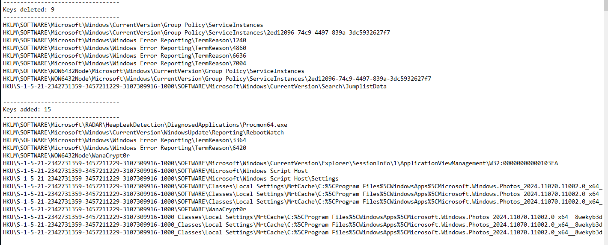
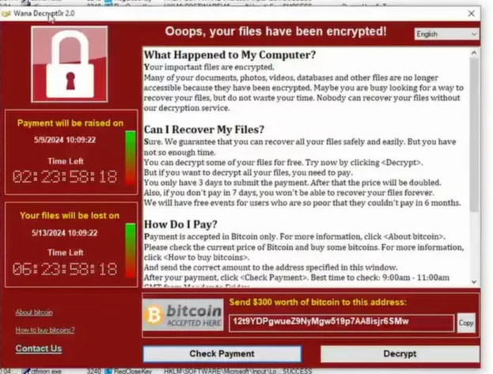
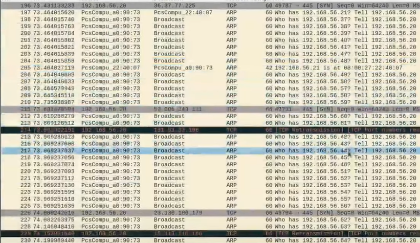

# Práctica 6 - Parte A

# Malware WannaCry

# Introduction

@Francesco Pizzato @Alberto Bettini 

WannaCry is a ransomware-worm that marked a turning point in the history of modern malware due to its rapid propagation and global impact. First appearing on May 11, 2017, it exploited the vulnerability CVE-2017-0144 (known as *EternalBlue*) in the SMB v1 protocol of Windows—an exploit stolen from the NSA (National Security Agency) and published by the Shadow Brokers group just a few weeks earlier.

Once a host was compromised, WannaCry would automatically replicate across the local network and the Internet, scanning open port 445 and infecting other vulnerable systems without requiring any user interaction. When active on a system, it encrypts files using the AES-128 algorithm in CBC mode, then protects the symmetric key with RSA-2048. Files are renamed with the `.wnry` extension, and a multilingual ransom note is left on the system with payment instructions. The malware demands a ransom in Bitcoin, threatening to permanently delete the private key if payment is not made within a few days.

Finally, WannaCry attempts to contact a “kill-switch” domain; if the domain responds, the malware halts, thereby limiting its spread. This mechanism was successfully used by security researcher Marcus Hutchins to quickly contain the outbreak.

We chose to analyze this powerful malware precisely because of its massive global influence: it was the most famous and widespread malware of recent years, and serves as a textbook case for studying both its social and economic impact, as well as the wide range of techniques it employs.

# Static analysis

@Francesco Pizzato 

## **0. Malware recovery**

From the virtual machine, we downloaded the WannaCry malware from its official repository on GitHub (*theZoo*): [https://github.com/ytisf/theZoo](https://github.com/ytisf/theZoo).

We navigated to the `theZoo/malware/Binaries/Ransomware.WannaCry` directory and extracted the executable from the password-protected ZIP archive using the following command:

```bash
unzip -P infected Ransomware.WannaCry.zip
```

The extracted file is named *ed01ebfbc9eb5bbea545af4d01bf5f1071661840480439c6e5babe8e080e41aa.exe*: the name corresponds to its **`SHA-256`** hash.

Using the following commands:

```bash
file ed01ebfbc9eb5bbea545af4d01bf5f1071661840480439c6e5babe8e080e41aa.exe
sha256sum ed01ebfbc9eb5bbea545af4d01bf5f1071661840480439c6e5babe8e080e41aa.exe
```

we identified the format of the sample:

- PE32 executable: Windows executable in Portable Executable format.
- GUI: application with a graphical user interface.
- Intel 80386: 32-bit architecture.
- 4 sections: typically `.text`, `.data`, `.rdata`, `.rsrc`.

and verified the integrity of the extracted executable. The computed hash matches the one listed in the `Ransomware.WannaCry.sha256` file found in the repository, confirming the authenticity of the sample.



## **1. Section Identification**

To identify the sections of the PE (Portable Executable) file, the following command was executed:

```bash
objdump -h ed01ebfbc9eb5bbea545af4d01bf5f1071661840480439c6e5babe8e080e41aa.exe
```


As shown in the image, the output confirms that the sample consists of four main sections, each with specific roles:

| Name | Description |
| --- | --- |
| `.text` | It contains the executable code of the malware. |
| `.rdata` | Read-only data, likely including constant strings. |
| `.data` | Section that holds initialized and modifiable variables. |
| `.rsrc` | Includes embedded resources, such as messages and icons. |

Furthermore, it can be observed that each section has its own offset, size, and permissions, in accordance with the typical structure of a Windows executable in PE32 format.

## **2.1 String Extraction**

To highlight the text and data embedded in the binary code without executing it, we extracted all strings of at least 6 characters into a `.txt` file using:

```bash
strings -n 6 ed01ebfbc9eb5bbea545af4d01bf5f1071661840480439c6e5babe8e080e41aa.exe > strings_wannacry.txt
```

which resulted in the following file:

[strings_wannacry.txt](data/strings_wannacry.txt)

From it, we highlight the most relevant information:

1. **Multilingual Ransom Note Templates**

WannaCry includes default ransom note files (`.wnry`) in many languages, confirming its global reach:

```
msg/m_english.wnry
msg/m_spanish.wnry
…
msg/m_vietnamese.wnry 
```

These templates contain messages and instructions for paying the ransom, localized for each country.


Map showing the spread of WannaCry. Source: Wikipedia.org

1. **Secondary Executables**

Within the main payload, two auxiliary processes are invoked:

- taskdl.exe – likely a downloader for additional components
- taskse.exe – likely a service or script executor
1. **System Commands and Permissions**

The malware uses Windows commands to modify permissions and hide the encrypted files:

```
icacls . /grant Everyone:F /T /C /Q
attrib +h .
cmd.exe /c "%s"
```

- `icacls` grants full access to all users
- `attrib +h` makes the files hidden
- the switch to `cmd.exe` shows the ability to execute arbitrary commands
1. **Bitcoin Ransom Addresses**

Three Bitcoin addresses are included for ransom payments:

```
115p7UMMngoj1pMvkpHijcRdfJNXj6LrLn
12t9YDPgwueZ9NyMgw519p7AA8isjr6SMw
13AM4VW2dhxYgXeQepoHkHSQuy6NgaEb94
```

These addresses match those documented in the original incident response reports.

1. **Encryption Functions**

The ransomware relies on the Microsoft RSA/AES cryptographic provider for encryption:

```
Microsoft Enhanced RSA and AES Cryptographic Provider
CryptAcquireContextA
CryptGenKey
CryptEncrypt
CryptDecrypt
CryptImportKey
CryptDestroyKey
CryptReleaseContext
```

These APIs handle key generation, key import, and the application of encryption algorithms.

1. **Compatibility Manifest**

The XML manifest reveals the required privileges and the supported operating systems:

```xml
<requestedExecutionLevel level="asInvoker"/>
<supportedOS Id="{8e0f7a12-bfb3-4fe8-b9a5-48fd50a15a9a}"/>   <!-- Windows 10 -->
<supportedOS Id="{4a2f28e3-53b9-4441-ba9c-d69d4a4a6e38}"/>   <!-- Windows 8 -->
…
```

- asInvoker: the ransomware does not require elevated privileges
- Official support from Windows Vista to Windows 10

## 2.2 Extraction of Imported Functions

To identify the system calls used by WannaCry, we extracted the PE import table using the following command:

```bash
objdump -p ed01ebfbc9eb5bbea545af4d01bf5f1071661840480439c6e5babe8e080e41aa.exe \
  | grep -A 30 "DLL Name" > imports_wannacry.txt
```

which generated the file:

[imports_wannacry.txt](data/imports_wannacry.txt)

Below are the main libraries and APIs grouped by category:

1. **KERNEL32.dll**

This library provides essential functions for file system and memory access—critical elements for WannaCry's operation. Specifically, the ransomware uses `CreateFileA`, `ReadFile`, and `WriteFile` to open, read, and encrypt the victim's files; it allocates and frees memory using `VirtualAlloc`, `VirtualFree`, and `HeapAlloc`; and coordinates concurrent access with `InitializeCriticalSection`, `EnterCriticalSection`, and `LeaveCriticalSection`. It also leverages `GetTempPathW` and `GetWindowsDirectoryW` to locate system paths and `CopyFileA` to duplicate files, while `Sleep` and `OpenMutexA` appear designed to introduce delays or evade sandbox analysis.

1. **USER32.dll**

WannaCry imports only the `wsprintfA` function from this library, used to format strings displayed in its ransom GUI. This allows it to dynamically construct messages shown to the user, including names of encrypted files, payment instructions, and countdown timers.

1. **ADVAPI32.dll**

This library hosts APIs required for persistence and encryption. The malware creates or modifies registry keys using `RegCreateKeyW`, `RegSetValueExA`, and `RegQueryValueExA` to ensure it runs automatically on system startup. It interacts with the Service Control Manager through `CreateServiceA`, `OpenServiceA`, `StartServiceA`, and `OpenSCManagerA` to manage potential malicious services. Finally, it uses `CryptAcquireContextA` and `CryptReleaseContext` to access the Microsoft RSA/AES cryptographic provider—a key component for encrypting the victim's files.

1. **MSVCRT.dll**

The C/C++ runtime library is used for low-level operations: opening and reading/writing files in C-style (`fopen`, `fread`, `fwrite`, `fclose`), string manipulation (`sprintf`, `strcpy`, `memset`, `strlen`, `wcscat`, `wcslen`), and memory management (`malloc`, `free`, `realloc`, `memcpy`). The presence of C++ support functions like `__CxxFrameHandler`, `_except_handler3`, and `_local_unwind2` also indicates that part of the code is written in C++, including runtime exception handling.

## 3.1 Packer Detection

To verify whether the malware was shipped “as-is” or packed, we searched within the executable for typical references to compression or obfuscation tools. Specifically, by running:

```bash
strings -n 6 ed01ebfbc9eb5bbea545af4d01bf5f1071661840480439c6e5babe8e080e41aa.exe \
  | grep -Ei 'upx|zlib'
```

the strings `UUPX((` and `vzliB` appeareD, unmistakable signatures of the UPX packer (which internally uses ZLIB for decompression).


However, when attempting to list the compressed sections using the standard command:

```bash
upx -l ed01ebfbc9eb5bbea545af4d01bf5f1071661840480439c6e5babe8e080e41aa.exe
```

UPX returned:


This behavior indicates that, although based on UPX, the sample uses a custom or modified version of the packer, which prevents standard recognition and unpacking with the official tool “out-of-the-box.”

## 3.2 Analysis of Compressed Sections

This command prints the first 20 bytes of the `.text` section in both hexadecimal and ASCII format, providing a snapshot of its content:

```bash
objdump -s -j .text ed01ebfbc9eb5bbea545af4d01bf5f1071661840480439c6e5babe8e080e41aa.exe | head -n 20
```

Thanks to this, we can demonstrate that the section does not contain recognizable IA-32 instructions, but rather seemingly “random” data and typical UPX/ZLIB fragments (for example, the bytes `55 55 50 58`, which form “UUPX(” in ASCII). This visually and immediately confirms that the code is compressed/obfuscated, rather than provided in clear form.


## 3.3 Search for Other Encryption Techniques

To complete the study of encryption techniques, we searched within the `.text` section for both decoding patterns (typically XOR loops or bit rotations) and actual invocations of cryptographic APIs.

1. **Search for Decoding Loops**

With this command, we filtered common instructions used by a custom obfuscator:

```bash
objdump -d -j .text ed01ebfbc9eb5bbea545af4d01bf5f1071661840480439c6e5babe8e080e41aa.exe \ | grep -E 'xor|rol|ror' > xor_loops.txt
```

and wrote them into the following `.txt` file:

[xor_loops.txt](data/xor_loops.txt)

It is evident that there are no specific loops whose primary purpose is to obfuscate the file; rather, these are simple register-clearing operations used to initialize the state before function calls. This confirms that there is no additional obfuscation layer based on XOR loops.

1. **Detection of CryptoAPI Calls**

Based on the import table (Section 2.2), we searched for the points where the malware invokes Microsoft's cryptographic functions:

```bash
objdump -p ed01ebfbc9eb5bbea545af4d01bf5f1071661840480439c6e5babe8e080e41aa.exe \
  | grep -E 'CryptAcquireContextA|CryptGenKey|CryptEncrypt|CryptDecrypt|CryptReleaseContext'
```

From the output obtained, we can see that, in a “static” manner, the only CryptoAPI directly imported is `CryptReleaseContext`.


The other functions (`CryptAcquireContextA`, `CryptGenKey`, `CryptEncrypt`, `CryptDecrypt`) do not appear in the Import Table: this means that WannaCry resolves them dynamically at runtime.

# Dynamic Analysis

@Alberto Bettini

## **1. Controlled execution environment**

For the dynamic analysis of the WannaCry ransomware, we set up a secure and isolated environment using a Windows 10 virtual machine configured with **FrameVM**, a solution specifically designed for malware analysis, as shown in the following [YouTube](https://www.youtube.com/watch?v=1Kb6tee2eJI) video used as a reference.

With the FrameVM software, we achieved quick snapshots, network monitoring, and complete isolation, which are essential to prevent damage to the host machine.

## **2. Kill-switch and DNS traffic analysis**

To verify the functionality of the kill-switch mechanism integrated into the malware, we used a second Linux virtual machine (REMnux), connected to the same virtual network as the vulnerable Windows 10 machine. On REMnux, we started the `fakedns` service, which intercepts all DNS requests and returns controlled responses.

As soon as it was executed, WannaCry attempted to resolve the hardcoded domain `www.iuqerfsodp9ifjaposdfjhgosurijfaewrwergwea.com`, a long and seemingly random name that serves as a kill-switch: if the domain responds with a valid address, the malware stops its execution, avoiding both file encryption and network propagation.

In our experiment, `fakedns` correctly intercepted the DNS request and replied with the fake IP address `192.168.56.21`, as shown in the following screenshot.



This response was sufficient to activate the kill-switch and block the execution of the ransomware, preventing the encryption phase. This behavior demonstrates the effectiveness of this control mechanism, likely introduced in the code as an anti-analysis measure or to allow controlled interruption of the infection if needed.

## **3. Execution and behavior verification**

Once the kill-switch was disabled, we proceeded with direct execution, monitoring its activities through Task Manager, the Registry Editor, and network analysis.

At the moment of execution, the observed behavior was consistent with what is described in the technical documentation of WannaCry:

### **3.1 Launch of secondary processes**

Immediately after execution, several processes associated with the malware appeared in Task Manager. Among them, `tasksche.exe`, `taskdl.exe`, and `taskse.exe` stood out, operating in the background with distinct functionalities:



- `tasksche.exe`: main dropper or service launcher
- `taskdl.exe`: downloader or secondary payload handler
- `taskse.exe`: component responsible for file encryption

### **3.2 Creation of a persistent service**

One of the malware’s first actions is the installation of a Windows service with a pseudo-random name (in our case `zibzfrziyfoytd779`). The service is configured with automatic startup (`Start=2`) and runs with elevated privileges (`LocalSystem`), thus ensuring persistence even after the system is rebooted.





The registry analysis also revealed numerous changes:

- Creation of keys in `HKLM` and `HKCU` for the automatic loading of the payload.
- Insertion of references to the `WanaCrypt0r` directory, used to store temporary data, keys, and log files.
- Deletion of keys related to diagnostic or system protection services, as a measure to hinder detection or recovery.



### **3.3 Activation of the user interface**

Finally, the ransomware launches the component `@WanaDecryptor@.exe`, responsible for displaying the ransom message to the user. The application window includes:

- A list of encrypted files
- Instructions for payment in Bitcoin
- A timer with progressive deadlines
- Links and buttons for “Check Payment”, “Decrypt”, and “Help”



## **4. Network behavior**

During the execution of the malware, network traffic was monitored using Wireshark in order to analyze any propagation activities or external communications. The analysis revealed aggressive behavior from the ransomware, typical of its worm component.

In particular, two distinctive patterns were detected:

- **SMB traffic** (port 445/TCP): WannaCry began sending TCP packets to other hosts on the network via port 445, which is used by the SMB protocol. This behavior confirms the attempt to exploit the EternalBlue vulnerability, which allows remote code execution through specially crafted packets. The goal is to spread laterally across the network, infecting all reachable vulnerable machines.
    
    
    
- **Massive ARP scan**: before attempting propagation, the malware performs a wide ARP scan on the local network (`192.168.56.0/24`) to identify active hosts. The captured packets clearly show requests such as “Who has 192.168.56.X?”, indicative of systematic network mapping. Immediately after each positive ARP reply, a connection attempt to port 445 of the identified host follows.
    
    
    

L’insieme di queste operazioni conferma il comportamento worm del malware: una volta eseguito su un host, WannaCry tenta attivamente di replicarsi sugli altri dispositivi della stessa rete locale, senza alcun bisogno di intervento da parte dell’utente.

## **5. File system behavior**

During the execution of the ransomware, we observed a series of abnormal activities on the file system, confirmed both by analysis with tools like Process Monitor and by directly exploring the compromised directories.

During execution, WannaCry:

- duplicates itself in the `C:\Windows\` directory with misleading names (`tasksche.exe`).
    
    
    
- creates `.wnry`, `.wnry.key`, `.wncry` files containing encrypted data, keys, and messages.
    
    
    

# **Final Conclusions**

@Alberto Bettini @Francesco Pizzato

This analysis demonstrates how an attack can exploit known vulnerabilities, evasion techniques, and careful design to cause extensive damage: WannaCry remains, to this day, a textbook case for understanding both advanced offensive techniques and the value of prevention.

The malware, in fact, represents a hybrid threat—acting both as ransomware by encrypting the victim’s files and as a worm by spreading autonomously via the SMB vulnerability CVE-2017-0144. Our tests confirmed that, once executed, it initiates a rapid ARP scan and systematically targets port 445 to replicate within the local network. We also verified the presence of a “kill-switch” based on a hardcoded domain: if the domain responds, the malware halts both encryption and propagation, thus providing a valuable containment point.
